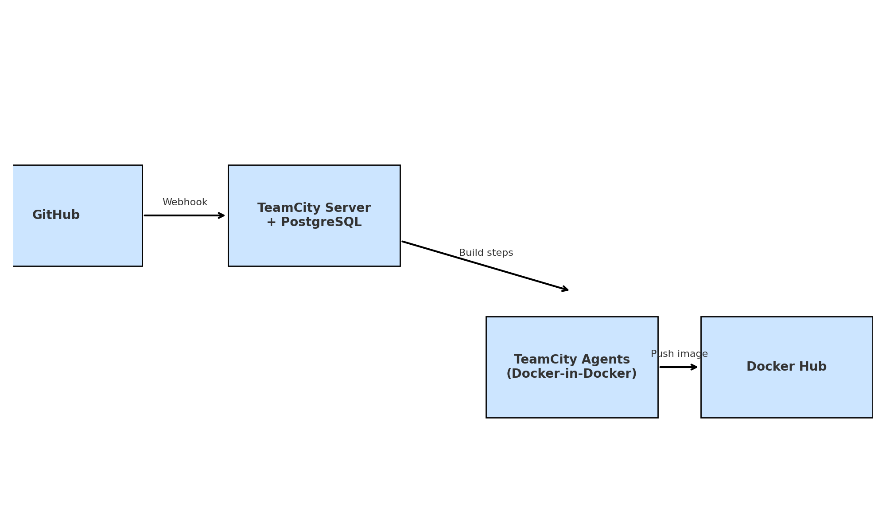

# 🚀 TeamCity CI/CD with Docker and GitHub

This lab demonstrates how to set up a **CI/CD pipeline** using **TeamCity**, **Docker**, and **GitHub**.  
It covers the full cycle: source code → build → test → Docker image build → push to Docker Hub.

---

## 🏗️ Architecture

- **GitHub** → hosts source code and triggers builds via webhook.
- **TeamCity Server** → orchestrates builds, stores configs, connects to PostgreSQL DB.
- **TeamCity Agents** → run build steps (Docker-in-Docker enabled).
- **PostgreSQL** → external DB for TeamCity server.
- **Docker Hub** → stores the built application image.

---

## ⚙️ Prerequisites

- Docker & Docker Compose installed
- Portainer (optional, for container management)
- Docker Hub account
- GitHub repository with your application code
- TeamCity server & agents deployed (with `/var/run/docker.sock` mounted)

---

## 🛠️ Setup

### 1. Database (PostgreSQL)
TeamCity is configured to use PostgreSQL on VM Proxmox

---

### 2. TeamCity Agents
Agents run with privileged mode and share the Docker socket to build images

3. GitHub Webhook

Configure webhook in your GitHub repo →
URL: http://<teamcity-server>:8111/app/rest/vcs-root-instances/commitHook/github

Trigger: Push events.

Build Steps in TeamCity
Step 1 — Install Dependencies & Run Tests
npm install --prefix app
npm test --prefix app

Step 2 — Build Docker Image
docker build -t teamcity-lab-app:latest -f app/Dockerfile app

Step 3 — Push Docker Image to Docker Hub
# Tag image
docker tag teamcity-lab-app:latest %env.DOCKER_USERNAME%/teamcity-lab-app:latest

# Login securely
echo "%env.DOCKER_PASSWORD%" | docker login -u "%env.DOCKER_USERNAME%" --password-stdin

# Push image
docker push %env.DOCKER_USERNAME%/teamcity-lab-app:latest

🔐 Secure Parameters in TeamCity

Define in Project → Parameters:

env.DOCKER_USERNAME → Docker Hub username

env.DOCKER_PASSWORD → Docker Hub password or token (mark as password)

✅ Pipeline Flow

Developer pushes code → GitHub webhook triggers TeamCity build.

Step 1: Install dependencies & run tests.

Step 2: Build Docker image.

Step 3: Tag & push image to Docker Hub.

New Docker image is available for deployment.

📊 Verification

In Portainer → Images, check that teamcity-lab-app:latest is built.

In Docker Hub → check your repository for the pushed image.

Test locally:

docker run -it --rm -p 3000:3000 <your-dockerhub-username>/teamcity-lab-app:latest

